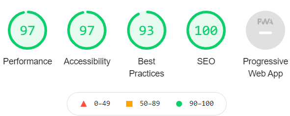

# A Walk Through Time
[Live link](https://sharpryan20.github.io/ci-project-one/index.html)

[GitHub Repository](https://github.com/Sharpryan20/ci-project-one#readme)

# Overview 

[A Walk Through Time](https://sharpryan20.github.io/ci-project-one/index.html) is my Portfolio 1 project. It is a site that promotes and highlights the joys and passions of nature with an added twist of history mixed into it. My target audience are people who enjoy long nature walks, whether that's through fields, forests, mountains. I aim to have a little bit of everything for everyone. 

The site is fully responsive and laid out in a minimal manner to present users with informational trail choices, and enough information to make choices without being misled on what they are looking at. The site is generated through html. I was originally given a brief of a project before I started or had the option to come up with my own. I decided to challenge myself and completely come up with an original idea and that is how 'A Walk Through Time' was created. The scope of the project does not include any back-end functionality, so whilst there is a form on my page, the information entered into the fields will not feed anywhere. 

# UX

The primary goal with the sites UX, in terms of UI, was to ensure the design was a sleek and simple design, almost minimalist, which helps unclutter and not overload the audience with information and overwhelm them. 

From the beginning in the early development stage with planning the wireframes of the website my goal was to have my images as a main focal point. To enforce that from the first interaction, I decided to have a full page image of a forest, which immediately gives the audience the feel of what the website is entailing. The landing page holds little to no information except for a couple of buttons which takes the customer to other parts of site.

## First Time Visitor Goals:

- As a first time visitor I need to able to navigate the site easily and clearly understand how to use the function of the site.
- I want to be able to see a clear list of trails, along with important details about each trails that is being offered.
- I want to quickly be able to find contact details if I need help with booking or facing bug issues.

## Returning Visitor Goals:

- I want my email address saved so filling in the form will be quicker in future.
- I want the experience to remain consistent and continue to find information about new and upcoming trails that the business is offering.
- I perhaps want to contact the site owner to make a suggestion.

# Design:

## Typography

- I used different styles of font for different elements in my site. My main logo font is lobster and it helps make it stand out from any other text on the site.

- My Headings for all of my pages use a font called 'Caveat'. I chose this font because it is easy to read and it makes it clear that the headings are the introduction to every page.

- Any other text that was used throughout the site has a font of 'roboto' and I chose this font because it looks very modern and again is easy to read. 

## Colour Scheme 

- The site's primary colours are green, cream, black and white. The above image shows the original colour section for the site, the primary colour was the green. All colours were picked and matched from [coolors.co](https://coolors.co/).

- The reason for my colour palette was to try and resemble nature as much as possible and the dark green really worked well with the type of images that I used. I then decided on a cream colour for the logo text and nav bar because it really contrasted with the green and made it easier to read for someone who may have difficult with seeing colours.

## Layout:

- As mentioned earlier, the site is deliberately minimal with what is showcased to provide easy access and to stop over clutter. I chose to use images to bring colour and to help break up the text on some of the pages. 

- Information about the business and the owners are presented as cards which enlarge when hovered over. The cards go from being side by side to being on top of eachother depending on the size of the user's device.

- Information about the trails that the website showcases work similar to the information cards about the company. However the audience will need to first hover over their preffered trail and only then will it bring up inofrmation about the type of trail they are interested in.

- In the future I would like to be able to have the cards about the trails to size in column size depending on the user's screen size. 

# Wireframes 

Below will be attached of all my wireframes. These were very basic mockups of how I intended my website to look from the beginning.

### Index.html 

My original plan as can be seen above was to have separate boxes on the home page which provided information and small catch phrases to draw in the target audience. However, throughout development I settled down on the idea that the home was more of a welcome page to the target audience. The only service it would have would be to help navigate people throughout the rest of the site.

### Trails.html 

When designing my trails page, my original plan was to have images floating left and right going all the way down the page, which a box either to the left or right of them depending on where the image was explaining about each of the trails. However, during development, I decided to have just the images first and then the information would be displayed when the user hovers over them.

### Phone And tablet Devices 

 

# Features

## Current Features

- Every page is responsive on all devices.

- Home page - This page contains buttons which will guide the audience to other places in the site.

- About page - This page provides the audience with information about me and the idea for the company.

- Trails page - A page which consists of a 3 x 3 grid which allows users to select and read up on their desired choosing.

- Book page - this page allows users to fill out a form which will help them book their favourite trails. (However, due to no back-end functionality, the information won't get fed anywhere)

- Contact page - A page which gives the users plenty of information on how to contact and find us if they need assistance with anything. 

## Future Features 

- Store - A store or even a basket section would be beneficial to the website because it will make booking trails for the user even easier.

# Technologies Used 

Below is everything that I used throughout development which helped with building the website.

- [HTML:](https://www.w3.org/html/)  - HTMl5 provided the content and the structure of my website. I used a few semantic elements where possible.

- [CSS:](https://www.w3.org/Style/CSS/) - CSS was used to style all my pages.

- [Google Fonts:](https://fonts.google.com/) - Google fonts was used to import all font types for the different elements.

- [Font Awesome:](https://fontawesome.com/) - Font awesome was used on all pages throughout the website to add icons for aesthetic and UX purposes.

- [Git](https://git-scm.com/) - Git was used for version control. Allowing me to create backups whenever significant changes were made to code by utilizing the gitpod terminal to commit to Git and Push to GitHub.

-  [GitHub:](https://github.com/) - GitHub was used to externally hold my repository. Will also use GitHub pages to deploy my website.

-  [Balsamiq:](https://balsamiq.com/) - Balsamiq was used tp create wireframes during the designing process.

-  [Coolors](https://coolors.co/) - Coolors was used to help design my colour palette for the website. 

# Testing 

Testing was carried out both manually and automatically. 

For Manual testing I constantly had a preview of the website and specifically the page I was working on which I would check on regularly and hard reset the browser so any changes to my code would appear. If I found there was an error with my code, especially when first working with media queries, I would use the dev tools to change, alter and add code and make sure it worked smoothly before then adding it to gitpod. I also tested responsiveness both through console tools, alongside using different browsers on different type of devices.My different browser is Google Chrome and this is where I did majority of my tests, but I was able to use safari, microsoft edge and firefox and test my website on them as well. 

I also regularly generated lighthouse reports which would help give me an indication on how well my page was preforming. There was a case in one of the reports where the performance was low due to the size of the images that I used. From that report I compressed my images down so they didn't create such a delay when loading up certain pages. I have an example here of a lighthouse report that was carried out on my contact.html page.

Automatic testing of my HTML and CSS structure were done in  to ensure there were no errors in my code and that it was formatted properly. (All of my pages and CSS was run through the validator and none of them show any errors)

Additionally to the above, I had given my Github pages link to various people in order to rigorously test the website, both on mobile and desktop.

## Bugs 

During the testing of the build I discorvered that content wasn't appearing how it was supposed to. I will list a few of the bugs below.

Bug: I had coded it so on mobile screen sizes, the nav bar turned into a dropdown menu, however for some reason it wasn't being implemented when testing the website. 

Solution: There was a problem in my code where one of my 'meta' was named viewport instead of description. As a result of that, it overrided the other viewport meta and caused my website to not work. 

Bug: My hero image for the index page wouldn't stretch to screen for mobile devices.

Solution: I altered my code and changed the height of the image from pixels to 'vh'. 

# Deployment

## GitHub Pages 

I deployed this site through GitHub pages. This was a simple process, as follows:

-   Log into GitHub
    
-   Go to the repository

-   Go to settings
    
-   Scroll down to "GitHub Pages" section
    
-   Select the source (I chose master branch in this instance)
    
-   After some time, the site will be deployed and ready to see.

